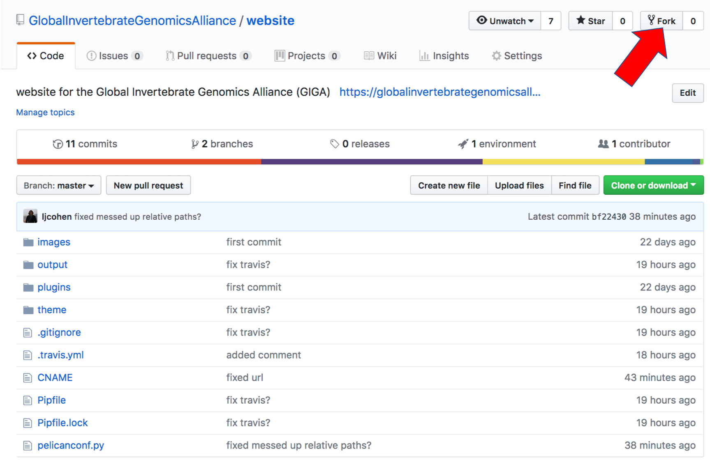

# Website for GIGA:
(temp) https://globalinvertebrategenomicsalliance.github.io/website/

Written with the Pelican static site generator using the [pelican-fh5co-marble theme](https://github.com/claudio-walser/pelican-fh5co-marble-example)

Deployed by [Travis-CI](https://travis-ci.com/GlobalInvertebrateGenomicsAlliance/website)

# Instructions for contributing content:

1. Fork your own copy of the repository to your account. (Requires [GitHub account](https://github.com/))

2. Make changes

3. Submit a pull request (PR) for review by 1 other person
